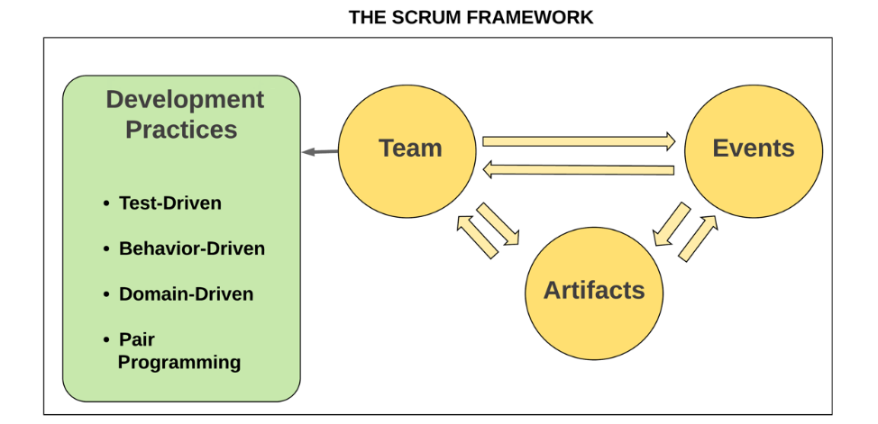
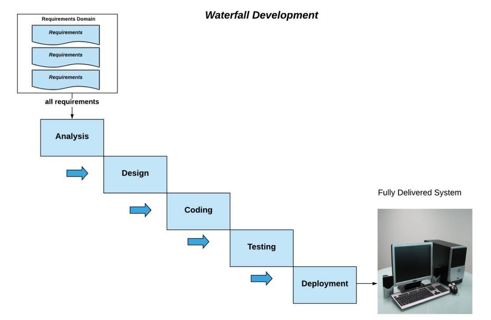
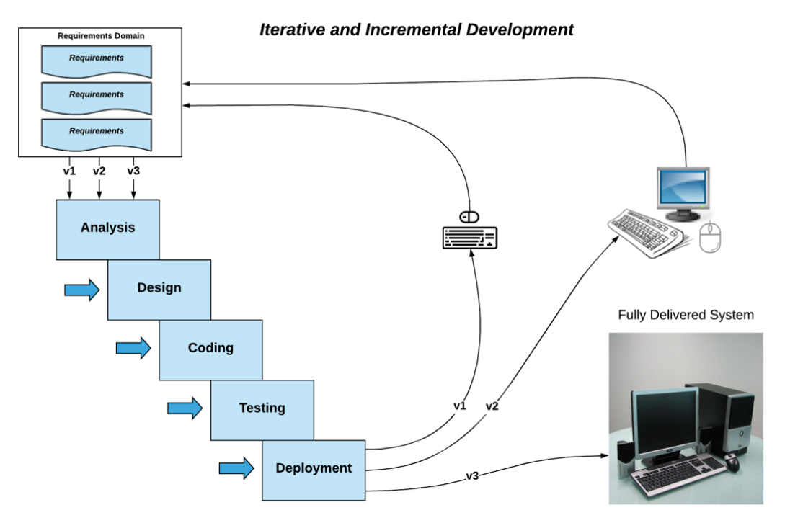

# The Scrum Framework

## What is Agile software development?

The Agile philosophy is best captured in the Agile Manifesto (2001), which identifies the following values:
• Individuals and interactions over processes and tools
• Working software over comprehensive documentation
• Customer collaboration over contract negotiation
• Responding to change over following a plan

Principles are as follows:

• Our highest priority is to satisfy the customer through early and continuous delivery of valuable software.

• Welcome changing requirements, even late in development. Agile processes harness change for the customer's competitive advantage.

• Deliver working software frequently, from every couple of weeks to every couple of months, with a preference for a shorter timescale.

• Businesspeople and developers must work together daily throughout the project.

• Build projects around motivated individuals.

• Give them the environment and support they need and trust them to get the job done.

• The most efficient and effective method of conveying information to and within a development team is face-to-face conversation.

• Working software is the primary measure of progress.
• Agile processes promote sustainable development.

• The sponsors, developers, and users should be able to maintain a constant pace
indefinitely.

• Continuous attention to technical excellence and good design enhances agility.

• Simplicity – the art of maximizing the amount of work not done – is essential.

• The best architectures, requirements, and designs emerge from self-organizing teams.

• At regular intervals, the team reflects on how to become more effective, then tunes and adjusts its behavior accordingly.

One of the most popular ways of being Agile is by applying Scrum in your
organization or team.

===

## What is Scrum?

It is important to emphasize that Scrum is a process framework, not a process by itself.
It introduces a number of rules, milestones, and checkpoints that must be adhered to, regardless of the underlying development process.

The Scrum framework consists of three components:

• The Scrum Team: A self-organizing, cross-functional set of people who will deliver the working software.

• Scrum Events: A number of time-boxed events that help create regularity, provide feedback, foster self-adjustment, and promote an iterative and incremental lifecycle.

• Scrum Artifacts: Items that represent work or added value and that provide transparency for the team's work progress and achievements. Artifacts are also the cornerstone of inspection and adaptation.

## software development methods

### The waterfall legacy

there were some serious drawbacks to this approach:

• First, it took a long time to actually deliver software to our users. Since we had to consider every possible requirement, and design and document every possible functionality before we could start coding, it would take months or often years to progress from system inception to system deployment. By that time, a competitor would have beaten us to the punch by delivering their system first or the business need for our system would have simply passed, overtaken by circumstances and changes in the market.

• Secondly, since we were moving sequentially from stage to stage, any design flaws or false assumptions that were discovered after deployment could not be fixed without a major re-haul of our system. This took a lot of time and effort.

• Finally, if requirements were changed by the customer once we were past the design stage, we would have to start pretty much from scratch again.

### Iterative and incremental software development

Iterative development means developing software in small chunks repeatedly, instead of waiting for everything to be finished and delivering a large chunk at the end. It entails breaking down the requirements that need to be implemented and implementing a few at a time. So instead of having a large, big-bang software delivery at the end of the project, we have many smaller deliveries at regular intervals. These delivery intervals are known as Iterations. In Scrum, we call an iteration a sprint.

Incremental development means that each iteration builds upon software delivered by previous iterations. So, if we implement Feature A in our first iteration (let's call this version 1 of our system), then in version 2 our users will expect to see Feature A and another feature too. Sometimes, we may have to deliver Feature A again, but this time working better or faster or having fixed a bug in it. The point is, each iteration should offer something more than the previous one. This chunk of software and functionality that each iteration adds to the system is called an Increment. In Scrum, an increment is not randomly produced but is intended to achieve a specific goal, to deliver the desired functionality or to fix a specific problem. This goal is decided at the beginning of the Sprint and is known as a sprint goal.

As shown, in an incremental and iterative development cycle, there is no separation between the development stages. So, within the same iteration, our team may be designing some feature, while coding some other feature, while testing a third one, all at the same time. This approach to development gives the developers the chance to correct any mistakes, fix any issues, and inspect and adapt to changing requirements at an early stage, which means less time and effort and less risk of failure or late delivery.

In an incremental and iterative cycle, we deliver working software at the end of each sprint. So, as illustrated, for Sprint 1 we deliver a crude version of our product that doesn't do much but outline what we try to build, with some basic functionality. At the end of the sprint, we showcase our software to the stakeholders and receive feedback. At the same time, we come together as the Scrum Team to inspect and review what we did well in the sprint and what we could improve. This gives us valuable information on how to improve the product in the next sprint, but also on how to improve our working practices.

In Sprint 2, we apply the lessons learned from Sprint 1 and deliver a much more functional version of the product with more and better features. Once again, at the end of the sprint, we receive feedback, inspect, and adapt in order to improve both our product and our workflow.

In the final sprint, we deliver the whole product, fully functional. By incorporating the feedback we received and the lessons we learned in the previous sprints, we understand the customer requirements much better and have improved our productivity and teamwork.