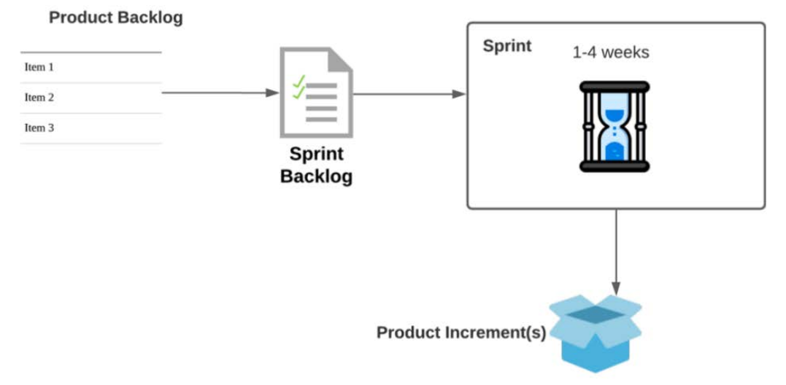
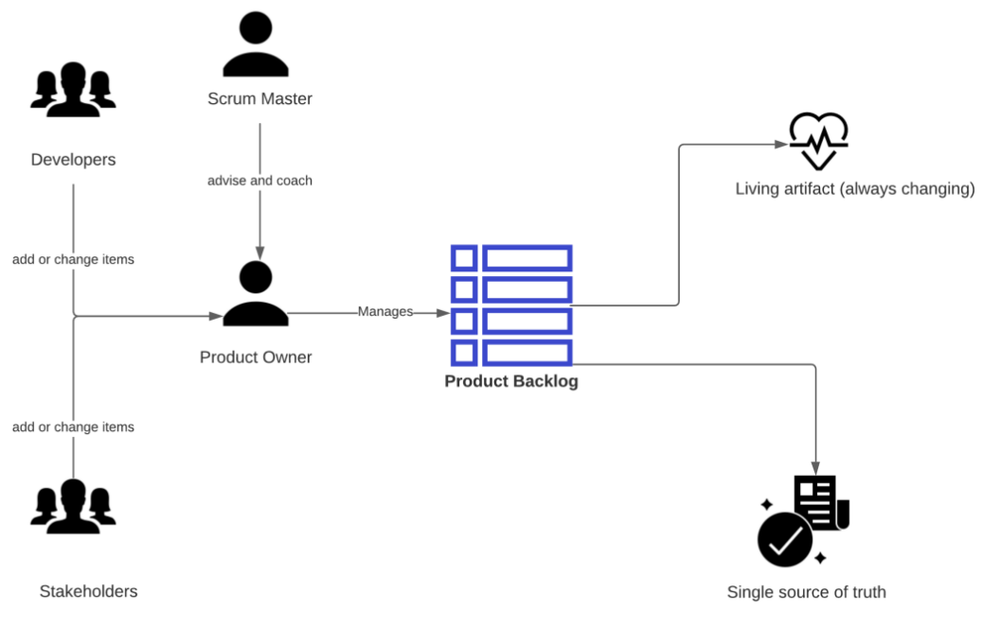
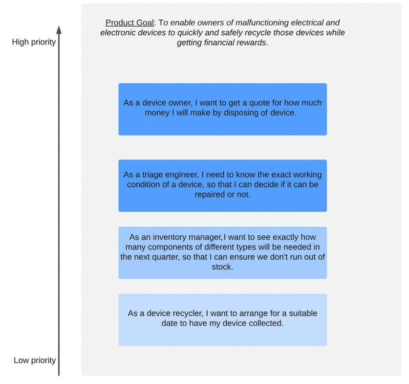
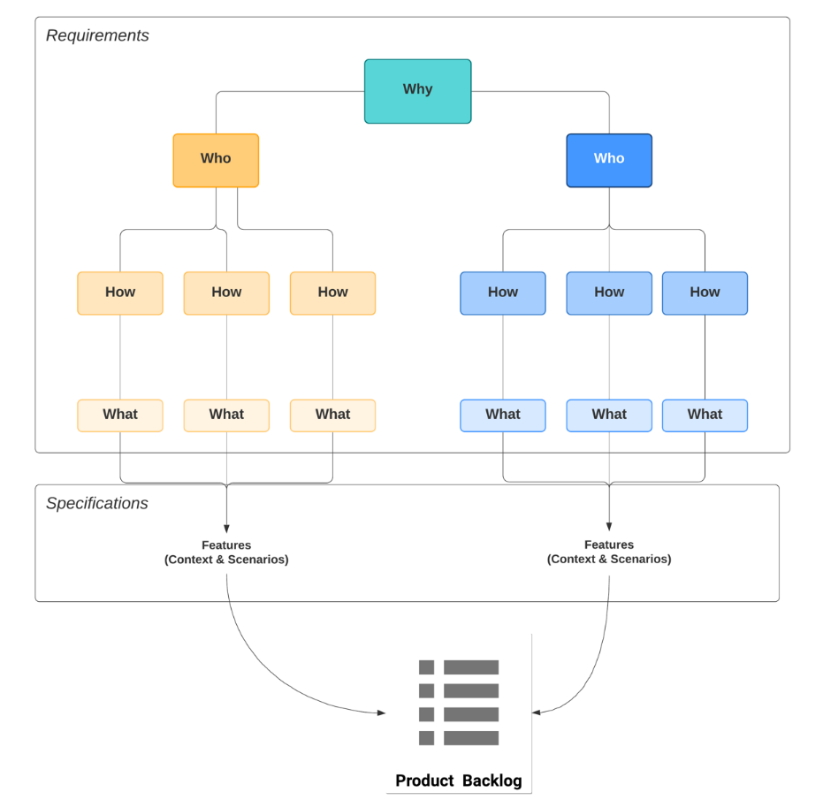
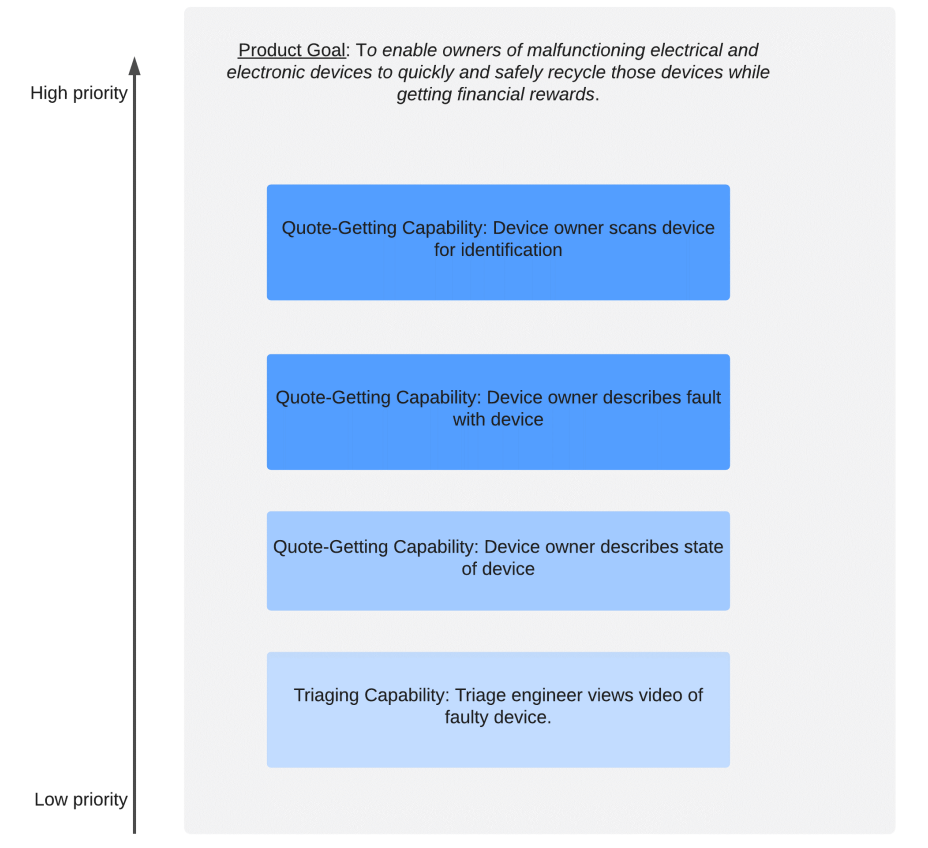

# Scrum Artifacts

## Understanding the value of Scrum Artifacts

Scrum Artifacts enable frequent inspections by the Scrum Team and the stakeholders and
allow us to detect undesirable deviations from the road toward product delivery. They
represent work that's performed to provide transparency and opportunities for inspection
and adaptation.

The work each artifact represents is as follows:

• The Product Backlog captures an ordered list of the project requirements and
allows us to create a product roadmap and define the items to tackle in a sprint.

• The Sprint Backlog enables us to clearly identify the work we intend to produce
during a Sprint, set alongside a Sprint Goal (see Chapter 4, Scrum Events, the
Starting the Sprint with Sprint Planning section).

• The Product Increment allows us to inspect the functionality of the work we
produced and potentially expose it to the stakeholders.

The artifacts and the relationships between them are depicted in the following diagram:

• The Product Backlog captures an ordered list of the project requirements and
allows us to create a product roadmap and define the items to tackle in a sprint.

• The Sprint Backlog enables us to clearly identify the work we intend to produce
during a Sprint, set alongside a Sprint Goal (see Chapter 4, Scrum Events, the
Starting the Sprint with Sprint Planning section).

• The Product Increment allows us to inspect the functionality of the work we
produced and potentially expose it to the stakeholders.

The Product Backlog is used to produce the Sprint Backlog. Developers work on Sprint
Backlog items through the Sprint, and they deliver them as a Product Increment.

Put together, these three artifacts represent a holistic view of the software development
lifecycle, from requirements (Product Backlog) to planning and development (Sprint
Backlog) to usable software (Product Increment).

Each artifact contains a commitment to ensure it provides information that enhances
transparency and focuses on how progress can be measured:

• For the Product Backlog, the commitment is the Product Goal.

• For the Sprint Backlog, the commitment is the Sprint Goal.

• For the Increment, the commitment is the Definition of Done.

## Creating and managing the Product Backlog

The Product Backlog is an ordered list of everything that is needed in the product. Each
product has its own unique backlog. It is the only source of planned work for the product.
The Product Backlog is a living artifact; it is constantly in flux as requirements and
market conditions change. The following diagram provides an overview of the role and
significance of the Product Backlog:

### Making a commitment – the Product Goal

Items are inserted into the Product Backlog to fulfill the Product Goal. The Product Goal
describes the future state of the product, which can serve as a target for the Scrum Team
to focus on and plan against. The Product Owner is responsible for defining and explicitly
communicating the Product Goal. The Product Goal is a long-term objective for the
Scrum Team. Every product decision should be taken with a view of accomplishing
this objective.

There are many ways to write the Product Goal, but for it to be really useful, we should
take the following into consideration:

• What are we doing? In other words, what are the characteristics of our product?
Who are we doing it for? Who's going to benefit the most from our product?

• How are they benefiting? What is our product's unique selling point (USP)? What
do we offer over our competitors?

### Creating Backlog items as user stories

The Scrum Guide refers to the Product Backlog as a generic list of items. It does not
specify what these items should be other than that they should have the attributes of a
description, order, estimate, and value. The de facto standard for representing such items
is the user story. Not everyone can quite agree on an exact definition of a user story, but
the following is a widely accepted one:

A user story is a concise description of some required functionality told
from the perspective of the person who needs or desires it.

User stories may be written in many formats, but the most commonly used template is
as follows:

As a <type of user>, I want <some goal> so that <I receive some benefit>.

Some examples of user stories are as follows:

• As a vegetarian pizza buyer, I want to see only the vegetarian toppings so that I can
order a pizza without getting distracted by toppings I won't choose.

• As a bank account holder, I want to see how much interest I earned in the last year,
so that I can decide whether to keep or change my account.

A typical Product Backlog will look as follows:

As we can see, the backlog is a list of ordered user stories and a Product Goal. User
stories are meant to serve as the start of a conversation about the enclosing requirements.
They are an implicit contract between the Product Owner and the developers. The
developers commit to talking to the Product Owner about the story before working on
it. The Product Owner commits to being available to the developers to answer questions
about the story, whenever that may be. This implicit contract is essential in an Agile
environment as it allows work on requirements to begin, even though all the details may
not be known.

#### Creating Stories with the three Cs

The three Cs denote the three critical aspects of a user story:

• Card: The card here refers to the index card or post-it note that was originally used
to capture user stories. The point here is that the story should capture the essence
of the requirements and not a full specification of the intended functionality. Notes
such as priority, size estimate ,and acceptance criteria may also be part of the story.
The rest should be derived through conversation with the Product Owner.

• Conversation: This is where the details of the requirements and derived functional
behaviors are brought to light. Conversations are between the developers and the
Product Owner (or stakeholders that have been referred to by the Product Owner).
These conversations usually take place several times as the mutual understanding
about the requirements increases. Documentation may also be generated because
of these conversations, such as BDD feature files, for instance.

• Confirmation: We need to be able to verify whether our work actually produces
the value the user story encapsulates. The best way to do that is to identify some
acceptance criteria; that is, conditions that indicate when the story has delivered
the required value to the stakeholders.

#### INVESTing in high-quality user stories

INVEST is an acronym that stands for a set of criteria that a good user story should
adhere to. It provides a useful mnemonic of six basic quality principles that should apply
to a story. Let's examine them:

• Independent: No user story should rely on another one. We should be able to
prioritize any story in the backlog individually, without triggering a cascade of
dependent stories.

• Negotiable: Stories are not specifications. A story should always leave room for
discussion. A good story will capture the essence of the requirements, but details
must be derived by having conversations.

• Valuable: Stories must deliver value to stakeholders. Stories that capture fun, hobby,
or gold-plating (unnecessary future improvements) requirements should not be
added to the Product Backlog.

• Estimable: Stories must contain enough information as to make it possible to
estimate the relative size or complexity of them. This means that the developers
must be able to have a fair idea of what needs to be done, after reading the story.

• Small: Stories should be scoped and sized in such a way that they can be
implemented within a Sprint.

• Testable: There should be a way to test a user story, even though the exact way to
do so may not be obvious or possible yet. The best way to achieve this is to add
measurable and objective acceptance criteria to the story.

### Creating Product Backlog items as features

This approach ensures that vague requirements, including user stories, are never added to
the Product Backlog. This is achieved by analyzing the requirements and modeling them
as impact maps. Impact mapping allows us to identify and define features that are specific
and well-scoped items of functionality that help implement the capabilities stakeholders
require from our product. An impact map template is shown in the
following diagram:

An impact map provides us with a structured, hierarchical view of our requirements. It
gives a clear visualization of the stakeholders, their goals, and the broader capabilities they
require of our product to accomplish those goals.

The identified features provide the content of our Product Backlog. They are presented in
the context of their respective capabilities, as shown in the following diagram:

### Refining the Product Backlog

Product Backlog refinement is the act of breaking down and further defining Product
Backlog items into smaller, more precise items. This is an ongoing activity that adds item
details, such as a detailed description, order, and size or complexity estimates. Refinement
helps us add value to the product by correctly identifying and scoping backlog items. It
helps us deal with changes and makes it easier to plan for the next Sprint.

The Product Owner is responsible for refining the Product Backlog but does not usually
perform this on their own. The Product Owner must work with the developers to
communicate and clarify item details, obtain estimates, and identify technical risks with
backlog items. The Scrum Master may also help the Product Owner find techniques for
effective item definition and methods for prioritizing and classifying items.

## Creating and managing the Sprint Backlog

The Sprint Backlog is simply a list of Product Backlog items that have been selected for
the Sprint, along with the plan for delivering them and accomplishing the Sprint Goal.
While the Product Owner is responsible for which items go in the Product Backlog, the
developers are solely accountable for which items go into the Sprint Backlog. The Product
Owner will make suggestions as to which items should go in the Sprint Backlog, but the
developers will decide based on their estimation of the work needed for each item and
their own capacity to deliver work within the Sprint. Often, if the Product Owner is very
insistent on including certain items in the Sprint, the developers may exclude other items
of equal size or complexity from the Sprint Backlog so that they can accommodate the
high-priority item.

### Making a commitment – the Sprint Goal

The artifact commitment for the Sprint Backlog is the Sprint Goal. This aims to capture
the reason this Sprint is undertaken. It encapsulates the objective of the Sprint. Progress
toward the Sprint Goal is inspected daily, during the Daily Scrum. If needed, developers may
adapt the Sprint Backlog as necessary by adjusting the upcoming planned work. As the
developers work during the Sprint, they keep the Sprint Goal in mind. If the work turns
out to be different than anticipated, they communicate with the Product Owner to adjust
the scope of the Sprint Backlog within the Sprint, without affecting the Sprint Goal.

Let's look at an example. A Sprint Goal that states, for example, Improve website
performance is simply too vague to be useful. A good Sprint Goal would say Decrease the
page load times for listings and payments. The team would have to agree on the criteria for
determining the success of the Sprint Goal, such as A full product listing must be shown
within 2 seconds or The payment page must load twice as fast as in the previous increment.

Clear and measurable Sprint Goals help the team focus and interact on what really adds
value to our product during a Sprint. They also make it much easier to plan for the Sprint.

### Planning for the Sprint

The plan for delivering the work needed to deliver the Sprint Backlog items consists of the
Product Backlog items selected for the Sprint, as well as the tasks required to implement
those items. If an item is what we need to deliver, the plan is what we need to do in order to
deliver it. For instance, if the work item is something such as As a gadget owner I want to
describe the fault with the gadget so that I can get an estimate for recycling it, then the plan
may involve creating the following tasks:
• Create a database schema for the gadget's description
• Create a HTML form for the gadget's description
• Add a web app endpoint for the gadget's description
• Integrate the gadget database into the Show Gadgets page

As with all Scrum Artifacts, the Sprint Backlog should be highly visible and transparent
to all stakeholders. The output of the Sprint Backlog is a Product Increment of working
software, which leads us conveniently to the following section.

## Producing a Product Increment

A Product Increment is the working software that's created during the Sprint. It is a
demonstrable stepping stone toward the Product Goal. Each increment is cumulative
to previous increments and thoroughly verified, ensuring that all the Increments work
together. An Increment must do the following:

• Be usable – a usable increment is a piece of software that can be used by
stakeholders to enact some functionality required and related to the Sprint Goal.

• Meet the Definition of Done, as discussed in the Making a commitment – Definition
of Done section.

### Making a commitment – Definition of Done

Many developers throughout the ages have asked the same question: When is a piece of
software done? The answer is usually subjective. For some people, done means that the
software does what they want it to do. For others, it's when it does what their clients want
it to do. For many, software is done only when fully tested. For others, it is done when it
has been successfully deployed to a server or to the internet. That is why having a shared
Definition of Done is so important.

The Definition of Done ensures that everyone understands when the work for an item
that's being implemented as part of the Increment is complete. It also means that the
work is potentially shippable; that is, it can be deployed and delivered to the stakeholders
for review. If a Product Backlog item does not meet the Definition of Done, it cannot be
released or even presented at the Sprint Review.

What we define as Done depends mainly on the product we're delivering, the domain
we're working in, and the organizational culture. The Definition of Done may encompass
many different criteria. Usually, these are a combination (of many or all) of the following:
• Unit tests are passing, ensuring the Increment is coded correctly.
• Functional tests are passing, ensuring the increment functions correctly.
• Integration tests are passing, ensuring the increment works well within the wider
context of our system or network.
• Continuous Integration build is passing, ensuring the increment works on a staging
or deployment environment.
• Code has been peer-reviewed, ensuring that best practices are being followed and
design or coding flaws have been picked up.
• Documentation has been created, ensuring everyone understands how and why the
increment works.
• The Increment has been user tested, ensuring the end users are satisfied with the
software.