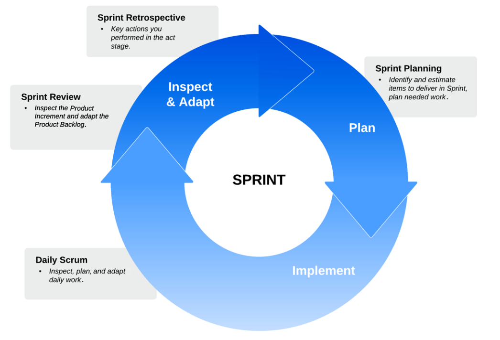

# Scrum Events

## Getting ready to Sprint

we examined the concept of developing software in short iterations,
where each iteration builds upon the working software provided by its predecessors. We
call such an iteration a Sprint. A Sprint is a container event, as all the other Scrum Events
take place within the duration and context of a Sprint. The ultimate purpose of the Sprint
is to have the Developers produce an Increment. An Increment is a piece of working and
potentially shippable software that leverages previous Increments.

Each Sprint begins with a planning phase. The is represented in Scrum by the Sprint
Planning event. The implementation phase, where all the development work happens,
is enabled by the Daily Scrum Event. Finally, the last phase of the Sprint (Inspection &
Adaptation) is marked by two events, the Sprint Review and the Sprint Retrospective.