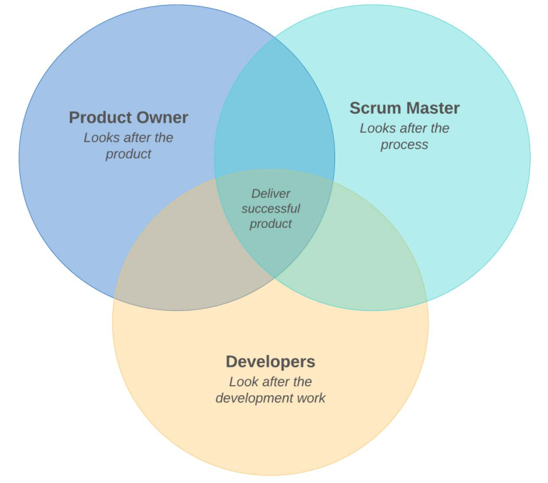

# The Scrum Team

## Identifying a Scrum Team

The Scrum Team consists of three specific roles, a **Product Owner**, a **Scrum Master**, and **Developers**.

The following diagram visualizes the roles within the Scrum Team:

## Introducing the Scrum Master

The Scrum Master role is one of the most misunderstood concepts of Scrum. Many people find it hard to understand the value of someone with no apparent authority or influence on the product or the team. However, the Scrum Master role is crucial for a team's success. The Scrum Master is often referred to as a servant-leader, and this is for good reason. They are the person who ensures that the team is working well together, that impediments to progress are quickly removed, and that the team is moving efficiently toward its goal. They interact with the rest of the Scrum Team but also with the organization and stakeholders.

### Scrum Master responsibilities

The Scrum Master is responsible for the following:

• Promoting and supporting Scrum as defined in the Scrum Guide (see the Further reading section)

• Helping the organization understand and enact Scrum

• Ensuring that Scrum Events take place at the appropriate time and that they are time-boxed

• Ensuring that the purpose and value of Scrum Events is well understood by the Scrum Team

• Ensuring that Scrum Events are conducted in a positive and constructive manner

• Removing impediments to the Developers' progress

• Helping provide transparency for Scrum Artifacts

• Coaching the Developers on how to increase self-management, cross-functionality, and productivity

• Helping stakeholders in their interactions with the Scrum Team

• Coaching and advising the organization on Scrum adoption techniques and practices

• Coaching the Product Owner on effective Product Backlog management techniques.

### Things outside the Scrum Master realm

The Scrum Master is someone who facilitates, rather than directs. They enable, instead of coercing. They advise, but do not dictate. Here are some of the things Scrum Masters are not responsible for:

• Product development, such as telling the Developers how to turn Product Backlog items into deliverable pieces of functioning code. The Developers are self-managing. However, the Scrum Master can advise them on how to be more productive or cross-functional.

• Product management, such as telling the Product Owner what to include in the Product Backlog or which items should be prioritized. However, the Scrum Master can advise the Product Owner on how to create clear and concise backlog items or suggest techniques for prioritizing items in the backlog.

• People management, such as employer performance reviews, time management, and similar activities. 

In short, the Scrum Master has authority over the process, but not the people or product.

A good way of thinking about the Scrum Master is like a personal coach at the gym. They can tell you how to do the exercises correctly, how to adjust the equipment, and they can motivate you towards reaching your training goal. But they cannot make you perform the exercises unless you want to do them. The personal coach is there to facilitate and enable your training regime and help you reach your goals. In a similar fashion, the Scrum Master is there to facilitate and enable the Scrum Team and help them reach their goals.

## Working with the Product Owner

While the Scrum Master helps the team move efficiently towards their goals, the Product Owner ensures that these goals are valid and beneficial. They set the vision and goals of the project. They are responsible for maximizing the value of the product based on the work of the Developers.

### Product Owner responsibilities

The Product Owner is responsible for the following:

• Managing the Product Backlog. This includes adding or removing items, ordering and prioritizing items, and ensuring that the backlog is visible and available to the Scrum Team and to stakeholders.

• Ensuring items in the backlog are clearly understood by the Developers, to a level that they can use the items to produce working code. 

• Monitoring and assessing progress towards the stated goals and product delivery and making this information available to stakeholders.

• Identifying the required objectives for the Sprint.

• Deciding whether a Product Increment is usable enough to be released.

• Canceling a Sprint. This should happen only if sudden and extraordinary circumstances render the Sprint Goal untenable. It should be a very rare event.

## Getting acquainted with the Developers

The Developers are a cross-functional, self-managing group that is responsible for converting Sprint Backlog items into working, releasable code.

Self-management means that they are responsible for making decisions about the work they are doing and about the way they function. There is no hierarchy among the Developers. No team member can tell another team member what to do. Disagreements must be resolved with discussions and consensus-forming. Traditionally, developers have been structured according to seniority and skillsets. The most senior developers would be making the decisions. Work would be split according to areas of expertise, for instance, the frontend expert would work on the UI, the testing expert would do the testing, and so on. This can still happen between Scrum Team Developers with consent, but it cannot be mandated. It may only happen organically with the team's input and acceptance. So the team may decide that a single person will be doing all testing work. This is fine, as long as the whole team has discussed and agreed to it. Self-management means that such decisions are not dictated by people outside the group.

A cross-functional group is a group that has all the necessary skills and capabilities required to turn backlog items into working, deliverable code. These skills and capabilities will differ depending on the domain and the project the team is working on. A project that involves transitioning a system to the cloud will require a much wider DevOps skillset than, say, a data management project. Conversely, a data management project will require a team with a strong business domain and analytical skills, rather than DevOps. A cross-functional team should have adequate skills to deliver what is needed to realize the product's goals and vision. This fosters a collective-ownership approach. Any team member can work on any task and there is no pass-the-buck blame mentality in the team.

A Scrum Team consists of up to 10 members. According to the Scrum Guide, larger teams are less productive and communicate more poorly. Taking into account the Product Owner and the Scrum Master, that means that a Scrum Team should include no more than 8 developers. On the other hand, fewer than 3 developers are likely to not have the necessary skill-set to deliver working software and may also have reduced productivity. Developers within the Scrum Team have no titles, though they may have different skills and experience levels. Everyone has an equal voice within the team.

### Developer responsibilities

Developers are responsible for performing the work needed to provide a Product Increment, that is, a body of Done and deliverable work. In detail, they are responsible for the following:
• Attending the Daily Scrum.
• Meeting after the Daily Scrum, to discuss, plan, or adapt the rest of the work required for the Sprint.
• Changing items in the Sprint Backlog during a Sprint, if needed.
• Collaborating with the Product Owner to define the Sprint Backlog.
• Attending the Sprint Planning meeting to help plan for the Sprint. This includes monitoring the team's capacity and estimating Product Backlog items.
• Define Done (see Chapter 6, Planning and Estimating with Scrum), if not already defined by the organization, and communicate its definition to the rest of the Scrum Team.

