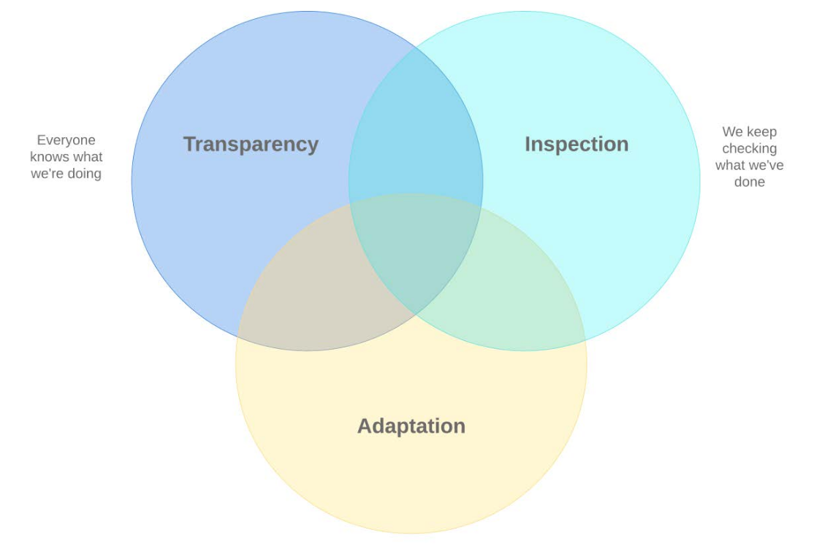

# Scrum Theory and Principles

## The foundation of Scrum

Scrum is founded on an empirical process theory of knowledge, or empiricism.

Empiricism is derived from the Greek word Empeiria, that is, experience. It is the theory that all knowledge should be based on, and justified by, practical experience. Learning is based on our observations, perception, and experience gained from practice. Empiricism is often contrasted with rationalism, another theory of knowledge that regards reason as the chief source and standard of knowledge.

Non-deterministic processes, such as software development, lend themselves very well to empiricism. Scrum provides multiple and frequent points for inspection and adaptation during the development process, thereby ensuring that any mistakes are caught and corrected early and that any requirement changes are adopted and integrated in plenty of time to avoid these accumulating and becoming detrimental to the system users. This constant application of inspection and adaptation, alongside transparency, is commonly known as the pillars of empiricism.

## The pillars of empiricism

For an empirical approach, such as **Scrum**, these pillars are **Inspection**, **Adaptation**, and **Transparency**.

Inspection is about asking the right questions, such as the following:

• Which practices that were followed did not work well?
• What are the things we did right in the Sprint?
• What could we have done better?

Adaptation is a natural consequence of Inspection. In fact, Adaptation cannot exist without Inspection. During Inspection, we learn things. We learn what we did right and what we did wrong, how circumstances or requirements have changed, why some things worked, and why some things didn't. Adaptation is about responding to these learnings. It's about making changes so that things that failed can succeed next time round but also so that things that went well can go even better. These changes don't always have to be technical, such as using different technologies, for instance. They may also be personal, such as committing to more honesty and openness, or even environmental, such as requesting a break-out area in the office or an ergonomic keyboard.

Transparency must be exercised across all three Scrum components: the team, the events, and the artifacts. There are specific ways in which Transparency can be applied in each of the components:

• Scrum Team: When the team starts working on a Sprint, they make the Sprint Goal visible to all stakeholders. This can be done by simply using a whiteboard at a place where everyone can see it or maybe using something more sophisticated such as a wiki or online collaboration tool. As the team works through the Sprint, its progress is also made visible to the stakeholders. Using a Scrum Board and burndown charts helps to achieve this. We'll talk more about these in Chapter 6, Planning and Estimating with Scrum.

• Events: As mentioned when we discussed Inspection and Adaptation, Scrum Events – such as the Sprint Review and the Sprint Retrospective – allow us to make changes, take actions, and create plans. These changes, actions, and plans must be visible to all stakeholders. How we do this is up to us; we may want to use specific tooling or just plain old email. The important thing here is that, whichever way we use it, the outcome of the Scrum Events is visible to all.

• Artifacts: Scrum has a number of artifacts such as the Product and Sprint Backlog (more on these in Chapter 5, Scrum Artifacts) that serve as information capture devices throughout the Scrum cycle. This information must be made clearly visible and understood by the team and all stakeholders. The visibility and availability of this information are crucial in making product-critical decisions.

===