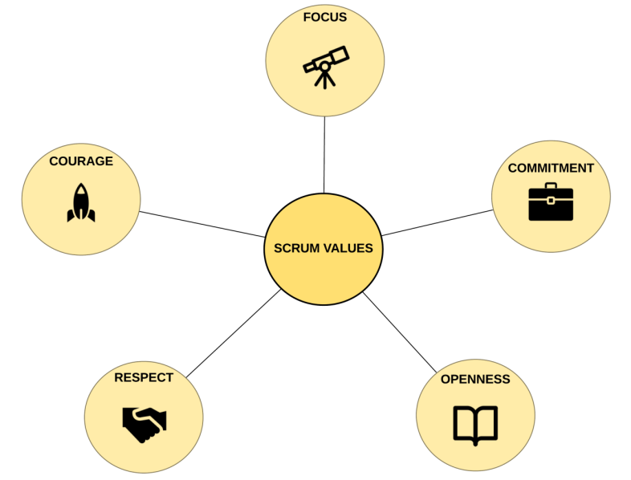
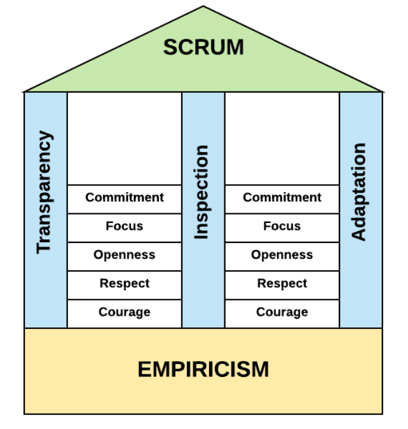

# Scrum Theory and Principles

## The foundation of Scrum

Scrum is founded on an empirical process theory of knowledge, or empiricism.

Empiricism is derived from the Greek word Empeiria, that is, experience. It is the theory that all knowledge should be based on, and justified by, practical experience. Learning is based on our observations, perception, and experience gained from practice. Empiricism is often contrasted with rationalism, another theory of knowledge that regards reason as the chief source and standard of knowledge.

Non-deterministic processes, such as software development, lend themselves very well to empiricism. Scrum provides multiple and frequent points for inspection and adaptation during the development process, thereby ensuring that any mistakes are caught and corrected early and that any requirement changes are adopted and integrated in plenty of time to avoid these accumulating and becoming detrimental to the system users. This constant application of inspection and adaptation, alongside transparency, is commonly known as the pillars of empiricism.

## The pillars of empiricism

For an empirical approach, such as **Scrum**, these pillars are **Inspection**, **Adaptation**, and **Transparency**.

Inspection is about asking the right questions, such as the following:

• Which practices that were followed did not work well?
• What are the things we did right in the Sprint?
• What could we have done better?

Adaptation is a natural consequence of Inspection. In fact, Adaptation cannot exist without Inspection. During Inspection, we learn things. We learn what we did right and what we did wrong, how circumstances or requirements have changed, why some things worked, and why some things didn't. Adaptation is about responding to these learnings. It's about making changes so that things that failed can succeed next time round but also so that things that went well can go even better. These changes don't always have to be technical, such as using different technologies, for instance. They may also be personal, such as committing to more honesty and openness, or even environmental, such as requesting a break-out area in the office or an ergonomic keyboard.

Transparency must be exercised across all three Scrum components: the team, the events, and the artifacts. There are specific ways in which Transparency can be applied in each of the components:

• Scrum Team: When the team starts working on a Sprint, they make the Sprint Goal visible to all stakeholders. This can be done by simply using a whiteboard at a place where everyone can see it or maybe using something more sophisticated such as a wiki or online collaboration tool. As the team works through the Sprint, its progress is also made visible to the stakeholders. Using a Scrum Board and burndown charts helps to achieve this. We'll talk more about these in Chapter 6, Planning and Estimating with Scrum.

• Events: As mentioned when we discussed Inspection and Adaptation, Scrum Events – such as the Sprint Review and the Sprint Retrospective – allow us to make changes, take actions, and create plans. These changes, actions, and plans must be visible to all stakeholders. How we do this is up to us; we may want to use specific tooling or just plain old email. The important thing here is that, whichever way we use it, the outcome of the Scrum Events is visible to all.

• Artifacts: Scrum has a number of artifacts such as the Product and Sprint Backlog (more on these in Chapter 5, Scrum Artifacts) that serve as information capture devices throughout the Scrum cycle. This information must be made clearly visible and understood by the team and all stakeholders. The visibility and availability of this information are crucial in making product-critical decisions.

---

## The Scrum values

• Commitment is about committing ourselves to the team and the Sprint Goal. It means that we are prepared to help the team achieve the goal, even though we may not personally agree with the goal or any design or architectural decisions made in its pursuit. Once the team has agreed on the tasks to be completed in a Sprint. we commit ourselves to finishing those tasks. Commitment does not mean that we blindly accept any  decision made by others and follow them unquestionably; it does mean however that once our questions have been answered and our doubts communicated to the team, we commit ourselves to the decided direction and goals. As Scrum Masters, we foster commitment by preventing mid-Sprint changes and removing any impediments that may prevent the team from committing to a task or a goal.

• Courage means that we are willing to accept when we are wrong or when our opinion does not align with the direction the team is going in. None of us are perfect, we all make mistakes, and – as the saying goes – it takes a brave person to admit their mistakes. Courage also means that we are prepared to have difficult conversations if need be. Courage does not mean being disparaging of other people's opinions, being argumentative, or pushing back against the consensus. As Scrum Masters, courage also means that we stand up to other stakeholders when they try to sidetrack the team from the Sprint Goal or when they try to undermine Scrum practices or principles.

• Focus is about keeping certain things in mind as high-importance items and finishing what we start. In the short term, our focus should be on achieving the Sprint Goal. In the longer term, our focus should be on delivering the product our customers need, while applying the Scrum values and supporting the pillars of Scrum. Scrum Masters encourage focus by encouraging full team participation at the daily Scrum meeting and helping the team define and adhere to the definition of Done.

• Openness is about being upfront and honest about what we do. We all come across issues and challenges that prevent us from completing our tasks. Being open means that we let the team know about them. It's better for the team to know about such things early than the customer finding out about them later on. Being open means presenting new ideas to the team and discussing them, rather than keeping them to ourselves. Openness also means that when we present an idea or design, we talk about its drawbacks as well as its advantages. Openness does not mean that we keep reminding everyone about our achievements or brag about our skills. Scrum Masters foster an open environment by encouraging team members to talk about any issues and ensuring constructive feedback from stakeholders is accessible to all team members.

• Respect is more about treating others with respect, rather than trying to earn it. Being respectful means that we consider other people's ideas and suggestions and if we disagree, we provide constructive criticism and reasoned arguments, instead of patronizingly dismissing them. Respect means recognizing that different people have different skillsets; some people will be better at something than us, while others will be worse. It means recognizing that people come from different backgrounds and will look at the same problem from different perspectives to our own. Last, but not least, we need to keep in mind that we are all human; we all make bad decisions, have bad days, and occasionally achieve great things. Respect is about recognizing and accepting this simple fact. Scrum Masters promote respect by encouraging the discussion of new ideas, instead of their dismissal. They encourage constructive feedback, instead of criticism. They promote collective team action to address shortcomings, rather than personal judgment and punitive actions.

## The House of Scrum

